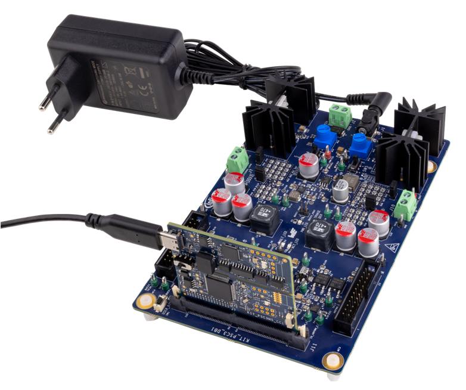
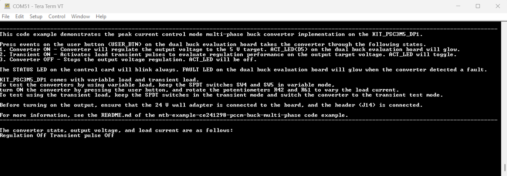
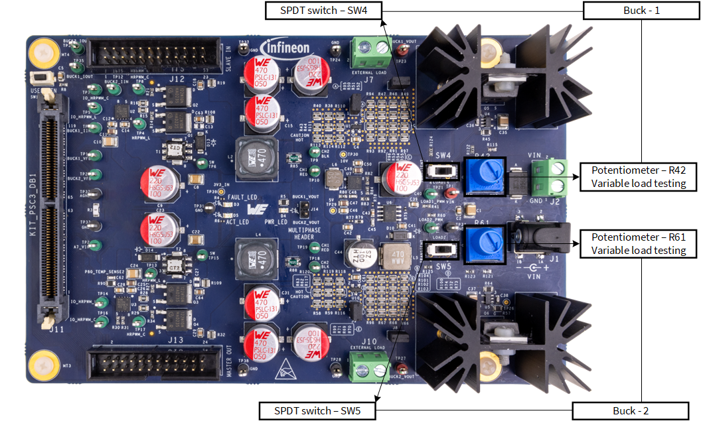
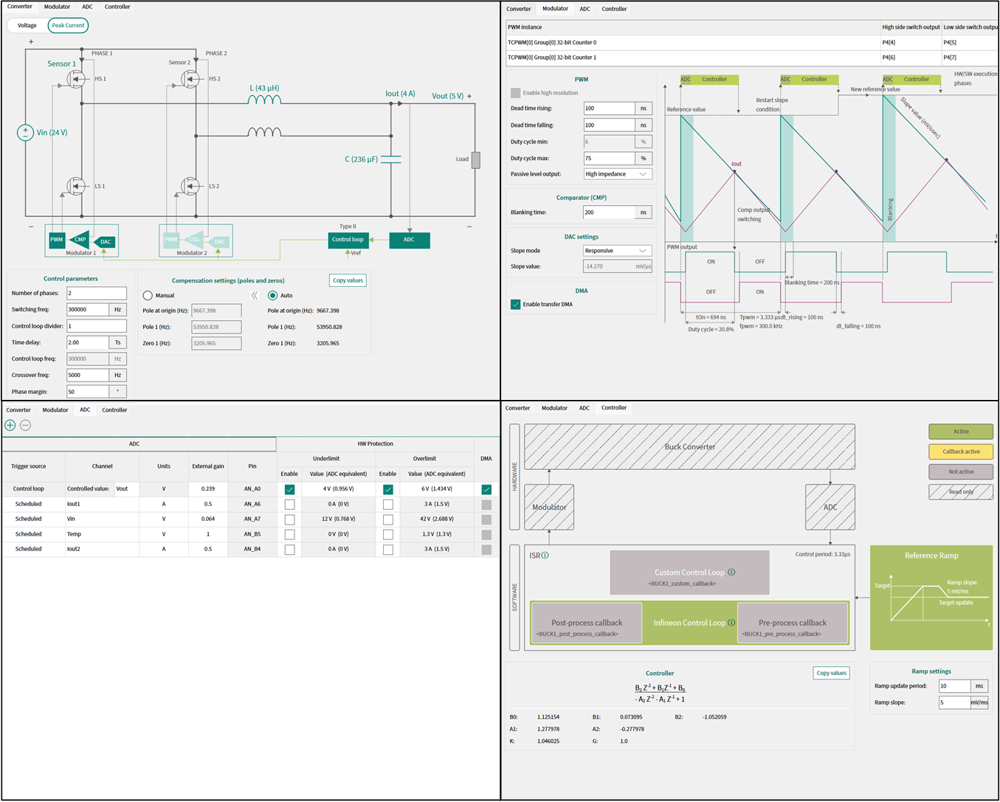
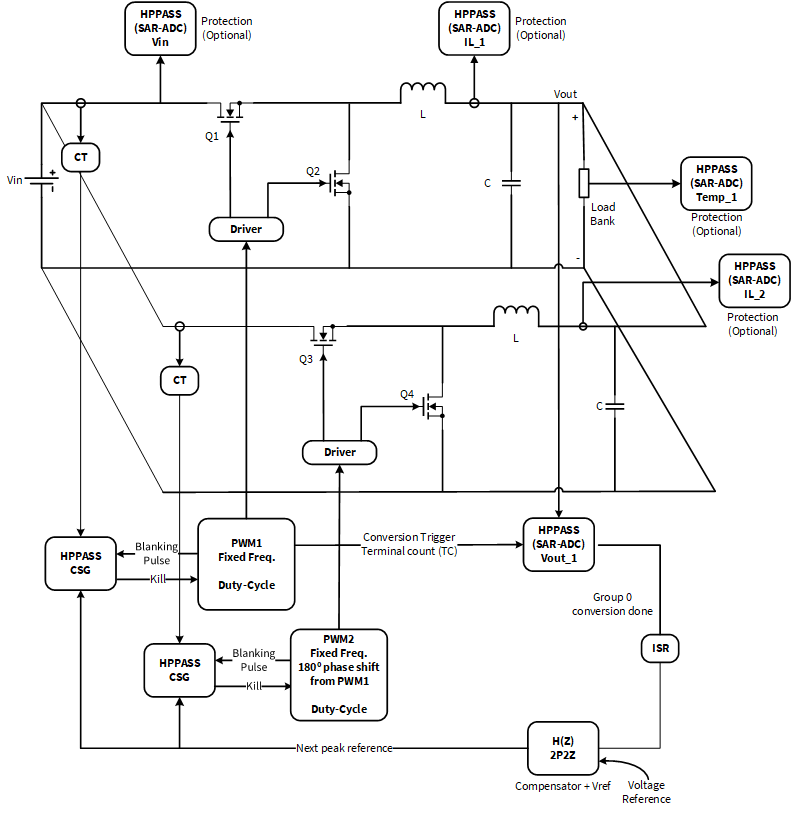
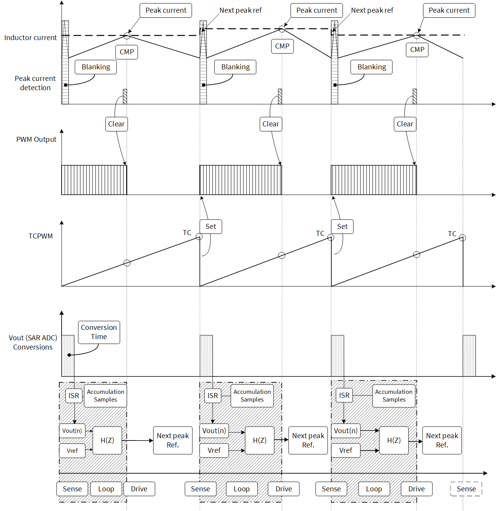
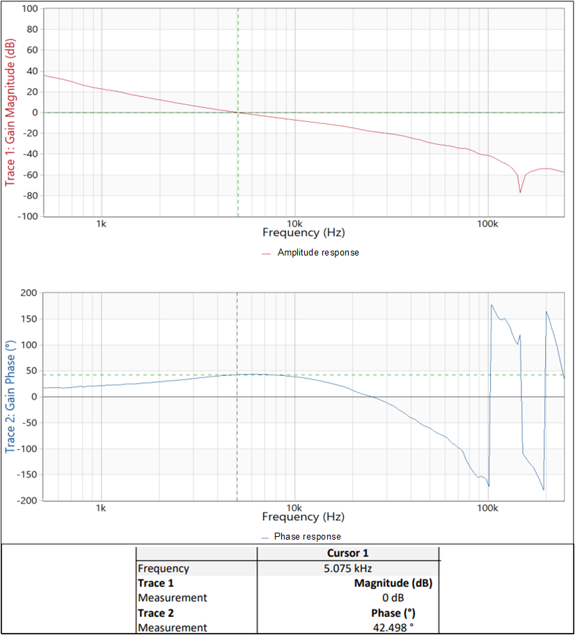
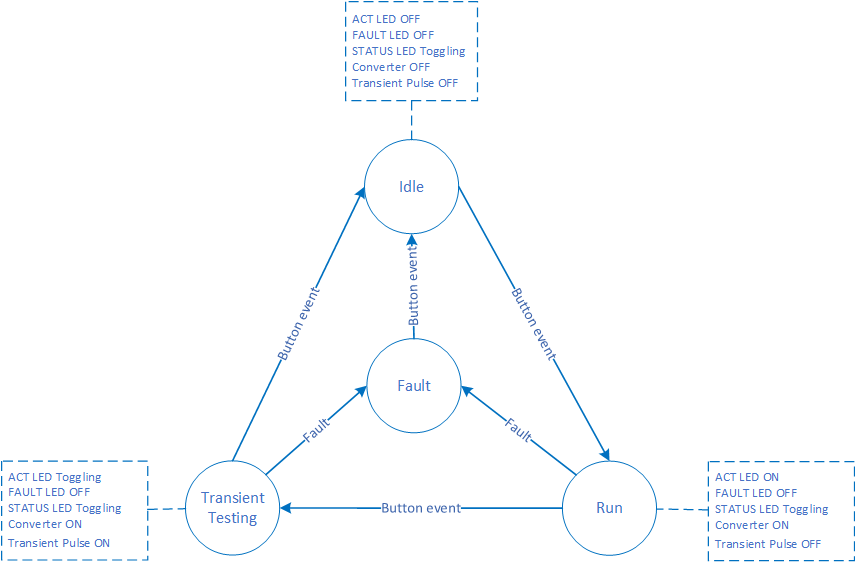

# PSOC&trade; Control MCU: PCCM buck converter multi-phase

This code example demonstrates a multi-phase buck converter in peak current control mode (PCCM) with the PSOC&trade; Control C3M5 Complete System Dual Buck Evaluation Kit. This code example uses the Power Conversion Configurator (PCC) tool and power conversion middleware for implementation.

[View this README on GitHub.](https://github.com/Infineon/mtb-example-ce241298-pccm-buck-multi-phase)

[Provide feedback on this code example.](https://cypress.co1.qualtrics.com/jfe/form/SV_1NTns53sK2yiljn?Q_EED=eyJVbmlxdWUgRG9jIElkIjoiQ0UyNDEyOTgiLCJTcGVjIE51bWJlciI6IjAwMi00MTI5OCIsIkRvYyBUaXRsZSI6IlBTT0MmdHJhZGU7IENvbnRyb2wgTUNVOiBQQ0NNIGJ1Y2sgY29udmVydGVyIG11bHRpLXBoYXNlIiwicmlkIjoiamhhd2FyIiwiRG9jIHZlcnNpb24iOiIxLjAuMCIsIkRvYyBMYW5ndWFnZSI6IkVuZ2xpc2giLCJEb2MgRGl2aXNpb24iOiJNQ0QiLCJEb2MgQlUiOiJJQ1ciLCJEb2MgRmFtaWx5IjoiUFNPQyJ9)


## Requirements

- [ModusToolbox&trade;](https://www.infineon.com/modustoolbox) v3.5 or later
- Board support package (BSP) minimum required version: 1.0.3
- Programming language: C
- Associated parts: All [PSOC&trade; Control C3 MCUs](https://www.infineon.com/cms/en/product/microcontroller/32-bit-psoc-arm-cortex-microcontroller/32-bit-psoc-control-arm-cortex-m33-mcu)
- ModusToolbox&trade; Industrial MCU Pack: v2.1 or later


## Supported toolchains (make variable 'TOOLCHAIN')

- GNU Arm&reg; Embedded Compiler v11.3.1 (`GCC_ARM`) – Default value of `TOOLCHAIN`
- Arm&reg; Compiler v6.22 (`ARM`)
- IAR C/C++ Compiler v9.50.2 (`IAR`)


## Supported kits (make variable 'TARGET')

- [PSOC&trade; Control C3M5 Digital Power Control Card](https://www.infineon.com/KIT_PSC3M5_CC1) (`KIT_PSC3M5_CC1`) – Default value of `TARGET`
- [PSOC&trade; Control C3M5 Complete System Dual Buck Evaluation Kit](https://www.infineon.com/KIT_PSC3M5_DP1) (`KIT_PSC3M5_DP1`)


## Hardware setup

This code example is intended to be used with the PSOC&trade; Control C3M5 Digital Power Control Card. The control card can be used with an interface board or a dual buck system board with two buck converter power stages on it. The combination with the dual buck system board is called "PSOC&trade; Control C3M5 Complete System Dual Buck Evaluation Kit".

This code example demonstrates the operation of the two converters available on the board in PCCM.

Follow these steps to set up the hardware to use this code example (See **Figure 1**):

1. Insert the PSOC&trade; Control C3M5 Digital Power Control Card to the dual buck evaluation board

2. Connect the Type-C cable provided with the kit between the control card and the PC

3. Connect the 24 V wall adapter provided with the kit to the connector J1 on the dual buck evaluation board and power socket

   **Figure 1. PSOC&trade; Control C3M5 Complete System Dual Buck Evaluation Kit**

   

4. Connect the jumper (J14) to configure the board in multi-phase topology

5. To measure the output voltage, connect an oscilloscope or multimeter to the output terminals of buck converter (TP23) or (TP27)

6. The dual buck evaluation board comes with onboard load. To use the onboard load, ensure that the jumpers J5 and J6 (for channel 1), and J8 and J9 (for channel 2) are mounted on dual buck evaluation board

To evaluate different signals, the test points (TP) are provided on the dual buck evaluation board. For PWM signals:

- TP5 and TP7 for buck 1
- TP14 and TP16 for buck 2

See the kit user guide for more information.


## Software setup

See the [ModusToolbox&trade; tools package installation guide](https://www.infineon.com/ModusToolboxInstallguide) for information about installing and configuring the tools package.

- Install a terminal emulator if you do not have one. Instructions in this document use [Tera Term](https://teratermproject.github.io/index-en.html)

- Install ModusToolbox&trade; Industrial MCU Pack from [Infineon Developer Center](https://softwaretools.infineon.com) to use the Power Conversion Configurator (PCC) tool


## Using the code example


### Create the project

The ModusToolbox&trade; tools package provides the Project Creator as both a GUI tool and a command line tool.

<details><summary><b>Use Project Creator GUI</b></summary>

1. Open the Project Creator GUI tool

   There are several ways to do this, including launching it from the dashboard or from inside the Eclipse IDE. For more details, see the [Project Creator user guide](https://www.infineon.com/ModusToolboxProjectCreator) (locally available at *{ModusToolbox&trade; install directory}/tools_{version}/project-creator/docs/project-creator.pdf*)

2. On the **Choose Board Support Package (BSP)** page, select a kit supported by this code example. See [Supported kits](#supported-kits-make-variable-target)

   > **Note:** To use this code example for a kit not listed here, you may need to update the source files. If the kit does not have the required resources, the application may not work

3. On the **Select Application** page:

   a. Select the **Applications(s) Root Path** and the **Target IDE**

      > **Note:** Depending on how you open the Project Creator tool, these fields may be pre-selected for you

   b. Select this code example from the list by enabling its check box

      > **Note:** You can narrow the list of displayed examples by typing in the filter box

   c. (Optional) Change the suggested **New Application Name** and **New BSP Name**

   d. Click **Create** to complete the application creation process

</details>


<details><summary><b>Use Project Creator CLI</b></summary>

The 'project-creator-cli' tool can be used to create applications from a CLI terminal or from within batch files or shell scripts. This tool is available in the *{ModusToolbox&trade; install directory}/tools_{version}/project-creator/* directory.

Use a CLI terminal to invoke the 'project-creator-cli' tool. On Windows, use the command-line 'modus-shell' program provided in the ModusToolbox&trade; installation instead of a standard Windows command-line application. This shell provides access to all ModusToolbox&trade; tools. You can access it by typing "modus-shell" in the search box in the Windows menu. In Linux and macOS, you can use any terminal application.

The following example clones the "[PCCM buck converter multi-phase](https://github.com/Infineon/mtb-example-ce241298-pccm-buck-multi-phase)" application with the desired name "PccmMultiPhaseBuck" configured for the *KIT_PSC3M5_CC1* BSP into the specified working directory, *C:/mtb_projects*:

   ```
   project-creator-cli --board-id KIT_PSC3M5_CC1 --app-id mtb-example-ce241298-pccm-buck-multi-phase --user-app-name PccmMultiPhaseBuck --target-dir "C:/mtb_projects"
   ```

The 'project-creator-cli' tool has the following arguments:

Argument | Description | Required/optional
---------|-------------|-----------
`--board-id` | Defined in the <id> field of the [BSP](https://github.com/Infineon?q=bsp-manifest&type=&language=&sort=) manifest | Required
`--app-id`   | Defined in the <id> field of the [CE](https://github.com/Infineon?q=ce-manifest&type=&language=&sort=) manifest | Required
`--target-dir`| Specify the directory in which the application is to be created if you prefer not to use the default current working directory | Optional
`--user-app-name`| Specify the name of the application if you prefer to have a name other than the example's default name | Optional

<br>

> **Note:** The project-creator-cli tool uses the `git clone` and `make getlibs` commands to fetch the repository and import the required libraries. For details, see the "Project creator tools" section of the [ModusToolbox&trade; tools package user guide](https://www.infineon.com/ModusToolboxUserGuide) (locally available at {ModusToolbox&trade; install directory}/docs_{version}/mtb_user_guide.pdf).

</details>


### Open the project

After the project has been created, you can open it in your preferred development environment.


<details><summary><b>Eclipse IDE</b></summary>

If you opened the Project Creator tool from the included Eclipse IDE, the project will open in Eclipse automatically.

For more details, see the [Eclipse IDE for ModusToolbox&trade; user guide](https://www.infineon.com/MTBEclipseIDEUserGuide) (locally available at *{ModusToolbox&trade; install directory}/docs_{version}/mt_ide_user_guide.pdf*).

</details>


<details><summary><b>Visual Studio (VS) Code</b></summary>

Launch VS Code manually, and then open the generated *{project-name}.code-workspace* file located in the project directory.

For more details, see the [Visual Studio Code for ModusToolbox&trade; user guide](https://www.infineon.com/MTBVSCodeUserGuide) (locally available at *{ModusToolbox&trade; install directory}/docs_{version}/mt_vscode_user_guide.pdf*).

</details>


<details><summary><b>Arm&reg; Keil&reg; µVision&reg;</b></summary>

Double-click the generated *{project-name}.cprj* file to launch the Keil&reg; µVision&reg; IDE.

For more details, see the [Arm&reg; Keil&reg; µVision&reg; for ModusToolbox&trade; user guide](https://www.infineon.com/MTBuVisionUserGuide) (locally available at *{ModusToolbox&trade; install directory}/docs_{version}/mt_uvision_user_guide.pdf*).

</details>


<details><summary><b>IAR Embedded Workbench</b></summary>

Open IAR Embedded Workbench manually, and create a new project. Then select the generated *{project-name}.ipcf* file located in the project directory.

For more details, see the [IAR Embedded Workbench for ModusToolbox&trade; user guide](https://www.infineon.com/MTBIARUserGuide) (locally available at *{ModusToolbox&trade; install directory}/docs_{version}/mt_iar_user_guide.pdf*).

</details>


<details><summary><b>Command line</b></summary>

If you prefer to use the CLI, open the appropriate terminal, and navigate to the project directory. On Windows, use the command-line 'modus-shell' program; on Linux and macOS, you can use any terminal application. From there, you can run various `make` commands.

For more details, see the [ModusToolbox&trade; tools package user guide](https://www.infineon.com/ModusToolboxUserGuide) (locally available at *{ModusToolbox&trade; install directory}/docs_{version}/mtb_user_guide.pdf*).

</details>


## Operation

1. Set up the hardware as explained in the [Hardware setup](#hardware-setup) section

2. Start the terminal emulator program and open the COM port emulated for the control card 
   
3. Configure the COM port with the following settings:
   
   **Speed**: 115200, **Data bits**: 8 bits, **Parity**: None, **Stop bits**: 1, **Flow control**: None

4. Build and download the project to the hardware
   
5. Press the reset button on the control card. The terminal displays the messages as shown in **Figure 2**. Verify that the STATUS LED on the control card is blinking

   **Figure 2. Terminal output on program startup** 
   
   
   
6. Press the **USER_BTN** on the dual buck evaluation board to start the regulation of output voltage in the buck converter. The ACT_LED(D5) on the dual buck evaluation board will start glowing

7. To test the converters using variable load, keep the SPDT switches SW4 and SW5 in variable mode and rotate the potentiometers R42 and R61 to vary the load current 
   
8. Measure the output voltage from both converters with TP23 (buck 1) and TP27 (buck 2) using an oscilloscope or a multimeter. It should show 5 V DC in both cases
   
9. To test the transient load, keep the SPDT switches in the transient mode and switch the converter to the transient test mode by pressing the user button. When the transient test is running, the ACT LED (D5) will blink

   **Figure 3. Switch and load details** 
   
   
   
10. Press the button again to stop the pulses for transient testing and output voltage regulation in the buck converter. ACT_LED(D5) will also turn off
 
11. Press the button again to repeat the sequence from **Step 6**

    > **Note:** Do not switch from the transient load to variable load using SPDT switches when the converter is running, as it will cause the converter to generate a fault signal. Only change it when the converter is in the OFF state
   
To evaluate different signals, the test points (TP) are provided on the dual buck evaluation board. For example, for PWM signals:

- TP5 and TP7 for buck 1
- TP14 and TP16 for buck 2

See the kit user guide for more information.


## Debugging

You can debug the example to step through the code.


<details><summary><b>In Eclipse IDE</b></summary>

Use the **\<Application Name> Debug (JLink)** configuration in the **Quick Panel**. For details, see the "Program and debug" section in the [Eclipse IDE for ModusToolbox&trade; user guide](https://www.infineon.com/MTBEclipseIDEUserGuide).


</details>


<details><summary><b>In other IDEs</b></summary>

Follow the instructions in your preferred IDE.

</details>


## PCC tool and middleware

The Power Conversion Configurator (PCC) tool is a software-ready solution that demonstrates application-oriented power converters and makes the firmware ready to users. The aim of the tool is to save design/R&D time of the user and provide an ecosystem to quickly develop power conversion solutions. It is an intuitive tool that allows the firmware generation needed for control systems in the context of power converters with just a few mouse clicks. 

The tool currently supports buck converter designing in various configurations, including single-instance, multi-instance, and multi-phase (interleaved) topologies, operating in both voltage control mode (VCM) and peak current control mode (PCCM). The tool also supports the control loop divider feature which enables the use of high PWM frequencies. It generates coefficients for 2p2z and 3p3z compensators based on the converter parameters.

The power conversion middleware provides a library of compensators using different power converter topologies; it also provides personalities to work with the Device Configurator and PCC tool. By using the power conversion middleware personalities, the Device Configurator and PCC tool generate customized firmware, ensuring a seamless and efficient design process.

The power conversion middleware and the PCC tool work together. In this code example, the middleware is added to the project and the configuration is updated with the PCC tool and Device Configurator to work as a PCCM multi-phase buck converter.

**Figure 4** shows the image of complete PCC tool.

**Figure 4. PCC tool**



> **Note:** See the [PCC tool](https://www.infineon.com/ModusToolboxPowerConvGuide) and [middleware documentation](https://infineon.github.io/mtb-pwrconv/html/index.html) for more information.


## Design and implementation

This code example is intended to be used with the PSOC&trade; Control C3M5 Complete System Dual Buck Evaluation Kit. Two synchronous buck converters are available on the dual buck evaluation board provided with the kit. The buck converters on the dual buck evaluation board can be used in multiple configurations, such as single-phase, multi-phase, and multi-instance. This code example demonstrates the multi-phase configuration. 

This code example converts a DC 24 V input provided to the dual buck evaluation board from the wall adapter to a stable DC 5 V output. Two instances of the PWM available with the chip drives the gates for the two buck converters. Another instance of the PWM is used for transient load testing at a frequency of 1 Hz (on time - 30% and off time - 70%). The ADCs and the comparator and slope generator (CSG) available with the high-performance programmable analog subsystem (HPPASS) are used in the feedback path. Two instances of DMA available and selectable through PCC tool per buck converter are used to transfer the data without CPU intervention. One DMA instance is used for transferring the data from ADC result register to output voltage variable in SRAM and another instance is used to transfer the output of the 2P2Z filter (next peak reference) to the DAC A buffer register. DMA usage is selectable through the PCC tool.

During peak current control, the output voltage is regulated by two essential loops:

- A digital voltage control loop executed at a defined control frequency which updates the peak current reference

- An analog current control loop based on DAC and comparator is provided in the analog peripheral of the PSOC&trade; Control C3M5 device

A 2P2Z compensator implemented in the firmware controls the outer voltage loop. It calculates the initial and final values for the slope generator in the CSG in all PWM cycles based on the measured output voltage and writes the results to the CSG registers. To achieve this, the PWM triggers an ADC conversion every PWM cycle. The ADC conversion complete signal triggers a DMA data transfer and generate a DMA transfer complete interrupt. The compensator runs within the interrupt service routine (ISR). As this implementation is multi-instance, one ADC groups is used for reading the output voltage from interleaved converters. ADC groups is triggered by the respective buck 1 PWMs on their terminal count.

The inner current loop is controlled by the CSG available with HPPASS. The inductor current captured through a current transformer is fed directly to the comparator of the CSG as one input. The comparator compares it with the reference generated by the internal DAC and modulates the PWM. 

The cycle-by-cycle current loop provides a good response for fast load transients. However, this becomes unstable with a duty cycle of over 50 percent. To avoid this, slope compensation is added to maintain an average current waveform and avoid instability. To enable slope compensation, the CSG can generate the slope from the initial and final values calculated by the compensator.

Three LEDs (STATUS LED, ACT LED, and FAULT LED) and a user button are available on the kit. Out of the three LEDs, ACT LED and FAULT LED are on the dual buck evaluation board while the STATUS LED is on the control card.

The user button can be used to switch the converter between different states. Behavior of the converter and the LED status are shown in **Figure 8** of the [Firmware states](#firmware-states) section.

The dual buck evaluation board integrates two onboard transient and variable load circuits, providing individual load control for each buck circuit. A single pole double throw (SPDT) switch, SW4 for buck 1 and SW5 for buck 2, provides easy selection between transient and variable load circuits, enabling flexible load management.

To perform the transient load test, it is required to keep the SPDT switch in transient mode and the same for the variable load test. The transient load circuit enables seamless load switching between 0.2 A and 1.8 A. Control for this circuit is managed by a 3.3 V PWM waveform from the PSOC&trade; C3M5 controller.

The variable load circuit supports load variation from 0.2 A to 1 A, controlled by potentiometers R42 for buck 1 and R61 for buck 2. The load can be increased by rotating the potentiometer clockwise and decreased by rotating it anti-clockwise.

**Figure 5** shows the block diagram of PCCM with a multi-phase converter.

**Figure 5. Block diagram - PCCM multi-phase**



One of the most prominent features of PSOC&trade; Control C3M5 devices is the comprehensive interconnectivity matrix within on-chip peripherals. The HPPASS and TCPWM modules are highly interconnected; the conversion can be run completely in the background. The start of the conversion is triggered when the terminal count of the TCPWM counter occurs. Once the conversion result is available, a DMA transfer complete interrupt service request is activated, and the outer voltage loop function is executed in software (2P2Z compensator) within the ISR.

**Figure 6** shows the PCCM timing diagram.

**Figure 6. PCCM timing scheme**



During the ON time of the PWM, the inductor current rises. When this current reaches the peak current reference level, the PWM ON time period is terminated by a trigger from the CSG. The output voltage is sampled periodically; any difference with the reference voltage is compensated for and supplied as the peak current reference.

### Frequency response:

**Figure 7** shows the frequency response captured from bode analyzer with these parameters. 

- The red line indicates the amplitude response
- The blue line indicates the phase response

**Figure 7. Frequency response** 




### Features of the CE

- Input voltage: 24 V
- Output voltage: 5 V
- Switching frequency: 300 kHz
- Control loop frequency: 300 kHz (control loop divider = 1)
- Crossover frequency: 5 kHz
- Phase margin: 50 degrees
- Pure time delay: 2
- Control loop execution time : 590 ns
- DMA based data transfer
- Control loop divider
- Hardware-based protection (ADC limit detection)
- Scheduled ADC group

The PCC tool has the option to enable callbacks functions. You can provide the name of the callback functions in the Device Configurator and PCC tool. As these functions are being called from the ISR, the functions must be defined as static inline functions to achieve optimal performance. The Device Configurator even gives you the option to name the header file. When the code is generated, it will include the header file in the generated files and add calls to the user functions from the ISR. These callback functions can be used for implementing features, such as overvoltage or overcurrent protection.

In this code example, using a callback functions called as `buck1_fault_callback` and `buck1_scheduled_adc_callback`.

> **Note:** See the [AN23829 - Synchronous buck converter with PSOC&trade; Control C3 MCU](https://www.infineon.com/dgdl/Infineon-AN239961_Synchronous_buck_converter_PSOC_Control_C3-ApplicationNotes-v01_00-EN.pdf?fileId=8ac78c8c93956f500193d7bf6d8c667c) for detailed information.

### Protection and soft start implementation

Protection mechanisms are implemented to avoid the system operating beyond a limit. Input voltage, output voltage, output current, and temperature are checked, ensuring the system is not damaged by operating beyond the values it could run.

Currently, the following values are set as the range:

- Input voltage lower limit: 12 V
- Input voltage upper limit: 42 V
- Output voltage lower limit: 4 V
- Output voltage upper limit: 6 V
- Output current upper limit: 3 A
- Board temperature upper limit: 75 degrees Celsius

The protection logic is implemented in two ways, hardware and software-based. For output voltage, ADC limit detection-based hardware protection is implemented. For input voltage, output current, and temperature scheduled ADC-based software protection is implemented. The protection logic runs within a callback function from the ISR, which is triggered by software/firmware every 100 Hz. The moving average of the input voltage, output current, and temperature is calculated. If any one of the values go out of the predefined range, a fault condition is triggered and the PWM is terminated. The FAULT LED glows to indicate the fault condition. 

In addition to the protection implementation, soft start is implemented to ensure that the output voltage ramps up gradually from zero on startup. An additional timer is used to implement this feature; it runs at 100 Hz and triggers interrupts at the terminal count. The soft start logic is implemented inside this ISR by gradually increasing the output reference value for the compensator. After the completion of soft start, the timer is kept enabled; to provide firmware trigger to the scheduled ADC group.


### Firmware states 

During startup, the firmware initializes the peripherals and configures the interrupt, and then waits for button interrupts. When it is pressed, the state machine switches between different states and turning ON and OFF of the converter, transient test pulses, LED, and more will take place. See **Figure 8** for more details.

**Figure 8. State machine** 



As **Figure 8** shows, the four states are implemented. During startup, the state machine is in the "Idle" state. When the button is pressed, it switches between the different states as shown in **Figure 8**. When a fault is detected by the firmware, it immediately switches to the "Fault" state and disables the converter and transient testing pulses. The converter can be restarted by pressing the user button again.


### Resources and settings

**Table 2. Application resources**

Resource  |  Alias/object     |    Purpose
:-------- | :-------------    | :------------
TCPWM[0] Group[0] Counter[0], P4.4, P4.5 | PWM_BUCK_1, PWM_B1_L, PWM_B1_C | PWM driving the gates of buck converter 1
TCPWM[0] Group[0] Counter[1], P4.6, P4.7 | PWM_BUCK_2, PWM_B2_L, PWM_B2_C | PWM driving the gates of buck converter 2
TCPWM[0] Group[1] Counter[0], P6.0, P6.1 | PWM_LOAD, LOAD_1, LOAD_2 | PWM for transient load testing
TCPWM[0] Group[1] Counter[1] | BUCK1_BLANK_PULSE | PWM for internal blanking pulse generation for buck converter 1
TCPWM[0] Group[1] Counter[2] | BUCK2_BLANK_PULSE | PWM for internal blanking pulse generation for buck converter 2
TCPWM[0] Group[2] Counter[0] | SOFT_START_COUNTER | Timer for soft start
TCPWM[0] Group[2] Counter[1], P9.5 | STATUS_LED | PWM for blinking status LED
TCPWM[0] Group[2] Counter[2], P2.3 | ACT_LED | PWM for blinking transient LED
ADC Sampler 0, AN_A0 | BUCK1_VOUT | Output feedback voltage from buck converter 1
ADC Sampler 5, AN_A5 | BUCK2_VOUT | Output feedback voltage from buck converter 2
ADC Sampler 6, AN_A6 | BUCK1_IOUT | Inductor current from buck converter 1
ADC Sampler 7, AN_A7 | VIN | Input voltage 
ADC Muxed Sampler 0, AN_B4 | BUCK2_IOUT | Inductor current from buck converter 2 
ADC Muxed Sampler 1, AN_B5 | BUCK1_TEMP | Board temperature from buck converter 1
ADC Muxed Sampler 3, P8.0 | BUCK2_TEMP | Board temperature from buck converter 2
CSG Slice 1, AN_A1 | IND_CURRENT_BUCK1 | Converter 1 high side switch current
CSG Slice 3, AN_A3 | IND_CURRENT_BUCK2 | Converter 2 high side switch current
DMA DW0, channel 0 | DMA_BUCK1_MOD | Data transfer from output of 2P2Z compensator to DAC A buffer register for buck converter
DMA DW0, channel 1 | DMA_BUCK1_PROT | Data transfer from ADC result register to output voltage variable for buck converter
P3.0 | FAULT_LED | Indication for fault detection
P3.1 | ACT_LED | Indication for converter running and transient testing status
P9.5 | STATUS_LED | Indication for code running status
P9.4 | USER_BUTTON | Button for switching between different states
SCB3 | DEBUG_UART  | UART HAL object used by retarget-I/O for the debug UART port

<br>


## Related resources

Resources  | Links
-----------|----------------------------------
Application notes  | [AN238329](https://www.infineon.com/cms/en/product/microcontroller/32-bit-psoc-arm-cortex-microcontroller/32-bit-psoc-control-arm-cortex-m33-mcu/psoc-control-c3p/#!documents) – Getting started with PSOC&trade; Control C3 MCU on ModusToolbox&trade; software <br> [AN239714](https://www.infineon.com/cms/en/product/microcontroller/32-bit-psoc-arm-cortex-microcontroller/32-bit-psoc-control-arm-cortex-m33-mcu/psoc-control-c3p/#!documents) – KIT_PSC3M5_DP1 Dual Buck Evaluation Board user guide <br> [AN239961](https://www.infineon.com/dgdl/Infineon-AN239961_Synchronous_buck_converter_PSOC_Control_C3-ApplicationNotes-v01_00-EN.pdf?fileId=8ac78c8c93956f500193d7bf6d8c667c) – Synchronous buck converter with PSOC™ Control C3 MCU 
Code examples  | [Using ModusToolbox&trade;](https://github.com/Infineon/Code-Examples-for-ModusToolbox-Software) on GitHub
Device documentation | [PSOC&trade; Control C3 MCU datasheet](https://www.infineon.com/cms/en/product/microcontroller/32-bit-psoc-arm-cortex-microcontroller/32-bit-psoc-control-arm-cortex-m33-mcu/psoc-control-c3p/#!documents) <br> [PSOC&trade; Control C3 technical reference manuals](https://www.infineon.com/cms/en/product/microcontroller/32-bit-psoc-arm-cortex-microcontroller/32-bit-psoc-control-arm-cortex-m33-mcu/psoc-control-c3p/#!documents)
Development kits | Select your kits from the [Evaluation board finder](https://www.infineon.com/cms/en/design-support/finder-selection-tools/product-finder/evaluation-board)
Libraries on GitHub  | [mtb-pdl-cat1](https://github.com/Infineon/mtb-pdl-cat1) – Peripheral Driver Library (PDL) <br> [mtb-hal-psc3](https://github.com/Infineon/mtb-hal-psc3) – Hardware Abstraction Layer (HAL) library <br> [retarget-io](https://github.com/Infineon/retarget-io) – Utility library to retarget STDIO messages to a UART port
Middleware on GitHub  | [mtb-pwrconv](https://infineon.github.io/mtb-pwrconv/html/index.html) – ModusToolbox&trade; power conversion middleware
Tools  | [ModusToolbox&trade;](https://www.infineon.com/modustoolbox) – ModusToolbox&trade; software is a collection of easy-to-use libraries and tools enabling rapid development with Infineon MCUs for applications ranging from wireless and cloud-connected systems, edge AI/ML, embedded sense and control, to wired USB connectivity using PSOC&trade; Industrial/IoT MCUs, AIROC&trade; Wi-Fi and Bluetooth&reg; connectivity devices, XMC&trade; Industrial MCUs, and EZ-USB&trade;/EZ-PD&trade; wired connectivity controllers. ModusToolbox&trade; incorporates a comprehensive set of BSPs, HAL, libraries, configuration tools, and provides support for industry-standard IDEs to fast-track your embedded application development

<br>


## Other resources

Infineon provides a wealth of data at [www.infineon.com](https://www.infineon.com) to help you select the right device, and quickly and effectively integrate it into your design.


## Document history

Document title: *CE241298* – *PSOC&trade; Control MCU: PCCM buck converter multi-phase*

 Version | Description of change
 ------- | ---------------------
 1.0.0   | New code example
<br>


All referenced product or service names and trademarks are the property of their respective owners.

The Bluetooth&reg; word mark and logos are registered trademarks owned by Bluetooth SIG, Inc., and any use of such marks by Infineon is under license.

PSOC&trade;, formerly known as PSoC&trade;, is a trademark of Infineon Technologies. Any references to PSoC&trade; in this document or others shall be deemed to refer to PSOC&trade;.

---------------------------------------------------------

© Cypress Semiconductor Corporation, 2025. This document is the property of Cypress Semiconductor Corporation, an Infineon Technologies company, and its affiliates ("Cypress").  This document, including any software or firmware included or referenced in this document ("Software"), is owned by Cypress under the intellectual property laws and treaties of the United States and other countries worldwide.  Cypress reserves all rights under such laws and treaties and does not, except as specifically stated in this paragraph, grant any license under its patents, copyrights, trademarks, or other intellectual property rights.  If the Software is not accompanied by a license agreement and you do not otherwise have a written agreement with Cypress governing the use of the Software, then Cypress hereby grants you a personal, non-exclusive, nontransferable license (without the right to sublicense) (1) under its copyright rights in the Software (a) for Software provided in source code form, to modify and reproduce the Software solely for use with Cypress hardware products, only internally within your organization, and (b) to distribute the Software in binary code form externally to end users (either directly or indirectly through resellers and distributors), solely for use on Cypress hardware product units, and (2) under those claims of Cypress's patents that are infringed by the Software (as provided by Cypress, unmodified) to make, use, distribute, and import the Software solely for use with Cypress hardware products.  Any other use, reproduction, modification, translation, or compilation of the Software is prohibited.
<br>
TO THE EXTENT PERMITTED BY APPLICABLE LAW, CYPRESS MAKES NO WARRANTY OF ANY KIND, EXPRESS OR IMPLIED, WITH REGARD TO THIS DOCUMENT OR ANY SOFTWARE OR ACCOMPANYING HARDWARE, INCLUDING, BUT NOT LIMITED TO, THE IMPLIED WARRANTIES OF MERCHANTABILITY AND FITNESS FOR A PARTICULAR PURPOSE.  No computing device can be absolutely secure.  Therefore, despite security measures implemented in Cypress hardware or software products, Cypress shall have no liability arising out of any security breach, such as unauthorized access to or use of a Cypress product. CYPRESS DOES NOT REPRESENT, WARRANT, OR GUARANTEE THAT CYPRESS PRODUCTS, OR SYSTEMS CREATED USING CYPRESS PRODUCTS, WILL BE FREE FROM CORRUPTION, ATTACK, VIRUSES, INTERFERENCE, HACKING, DATA LOSS OR THEFT, OR OTHER SECURITY INTRUSION (collectively, "Security Breach").  Cypress disclaims any liability relating to any Security Breach, and you shall and hereby do release Cypress from any claim, damage, or other liability arising from any Security Breach.  In addition, the products described in these materials may contain design defects or errors known as errata which may cause the product to deviate from published specifications. To the extent permitted by applicable law, Cypress reserves the right to make changes to this document without further notice. Cypress does not assume any liability arising out of the application or use of any product or circuit described in this document. Any information provided in this document, including any sample design information or programming code, is provided only for reference purposes.  It is the responsibility of the user of this document to properly design, program, and test the functionality and safety of any application made of this information and any resulting product.  "High-Risk Device" means any device or system whose failure could cause personal injury, death, or property damage.  Examples of High-Risk Devices are weapons, nuclear installations, surgical implants, and other medical devices.  "Critical Component" means any component of a High-Risk Device whose failure to perform can be reasonably expected to cause, directly or indirectly, the failure of the High-Risk Device, or to affect its safety or effectiveness.  Cypress is not liable, in whole or in part, and you shall and hereby do release Cypress from any claim, damage, or other liability arising from any use of a Cypress product as a Critical Component in a High-Risk Device. You shall indemnify and hold Cypress, including its affiliates, and its directors, officers, employees, agents, distributors, and assigns harmless from and against all claims, costs, damages, and expenses, arising out of any claim, including claims for product liability, personal injury or death, or property damage arising from any use of a Cypress product as a Critical Component in a High-Risk Device. Cypress products are not intended or authorized for use as a Critical Component in any High-Risk Device except to the limited extent that (i) Cypress's published data sheet for the product explicitly states Cypress has qualified the product for use in a specific High-Risk Device, or (ii) Cypress has given you advance written authorization to use the product as a Critical Component in the specific High-Risk Device and you have signed a separate indemnification agreement.
<br>
Cypress, the Cypress logo, and combinations thereof, ModusToolbox, PSoC, CAPSENSE, EZ-USB, F-RAM, and TRAVEO are trademarks or registered trademarks of Cypress or a subsidiary of Cypress in the United States or in other countries. For a more complete list of Cypress trademarks, visit www.infineon.com. Other names and brands may be claimed as property of their respective owners.
